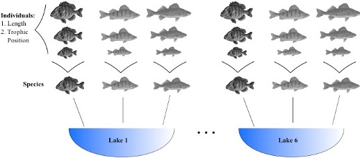

For this tutorial, we will need to install and load some packages using the `library` function. 

#Load libraries
```{r}
 library(here)
 library(ggplot2)
 library(lme4)
 library(MuMIn)
```

We are interested in whether fish trophic position increases with fish size. To answer this question, we have measured body length in 3 different fish species with 10 individuals sampled per species across 6 different lakes.
*Lake = Lake ID
*Fish_Species = Fish species ID
*Fish_Length = length of the fish in mm
*Trophic_Pos = trophic position [primary producers = 1, herbivores = 2, carnivores = 3 and up]
{width=1000px}
Let's read in the data and make some exploratory plots of the relationship between trophic position and size.

#Explore data
```{r}
# Load the dataset
fish.data <- read.csv(here('data/fishdata.csv'), stringsAsFactors = TRUE) 

# Set a simple theme for all ggplot figures
fig <- theme_bw() + 
  theme(panel.grid.minor=element_blank(), 
        panel.grid.major=element_blank(), 
        panel.background=element_blank(), 
        strip.background=element_blank(), 
        strip.text.y = element_text(),
        legend.background=element_blank(),
        legend.key=element_blank(),
        panel.border = element_rect(colour="black", fill = NA))

# Basic plot aesthetics for the relationship we care about
plot <- ggplot(aes(Fish_Length, Trophic_Pos), data = fish.data)

# Plot 1 - All data
plot + geom_point() + 
  labs(x = "Length (mm)", y = "Trophic position", 
       title = "All data") + 
  fig

# Plot 2 - By species
plot + geom_point() + 
  facet_wrap(~ Fish_Species) + 
  labs(x = "Length (mm)", y = "Trophic position", 
       title = "By species") + 
  fig

# Plot 3 – By lake
plot + geom_point() + 
  facet_wrap(~ Lake) + 
  labs(x = "Length (mm)", y = "Trophic position", 
       title = "By lake") + 
  fig
```

#Question 1
Does the relationship between trophic position and length appear to differ by species and/or lake? In what way(s)?

Now let's take a look at the data structure and the distribution of our continuous variables. In this chunk, we will also re-scale our variables to avoid convergence errors, and plot the residuals of a linear model against our potential random effects. As you can see, the plots suggest that there is residual variance that could be explained by these factors, so they should be included in the model.

#Explore data II
```{r}
# Look at data structure
str(fish.data)

# Look at the distribution of samples for each factor
table(fish.data[ , c("Lake", "Fish_Species")])

# Look at the distribution of continuous variables:
par(mfrow = c(1, 2), mar = c(4, 4, 1, 1))
hist(fish.data$Fish_Length, xlab = "Length (mm)", main = "")
hist(fish.data$Trophic_Pos, xlab = "Trophic position", main = "")

# Re-scale your variables
# Standardized length, "by hand"
fish.data$Z_Length <- (fish.data$Fish_Length - mean(fish.data$Fish_Length)) / 
                      sd(fish.data$Fish_Length)

# Standardized trophic position, with the function scale
fish.data$Z_TP     <- scale(fish.data$Trophic_Pos)

# Simple linear test of relationship between fish length and trophic position
lm.test <- lm(Z_TP ~ Z_Length, data = fish.data)

#Save residuals
lm.test.resid <- rstandard(lm.test)

#Plot residuals by species and by lake
par(mfrow = c(1, 2))

plot(lm.test.resid ~ as.factor(fish.data$Fish_Species),
     xlab = "Species", ylab = "Standardized residuals")
abline(0, 0, lty = 2)

plot(lm.test.resid ~ as.factor(fish.data$Lake),
     xlab = "Lake", ylab = "Standardized residuals")
abline(0, 0, lty = 2)

#Fit a linear mixed model with lake and fish species as random effects
lmer(Z_TP ~ Z_Length + (1 | Lake) + (1 | Fish_Species),
     data = fish.data, REML = TRUE)
```

#Question 2
Now develop a linear mixed model that allows the slopes of the relationship between trophic position and body length to vary by lake and species. Note: You don't have to evaluate how well the model works or fix any warnings, just show me how you would code it.

#Question 3
Next let's make a list of 7 different mixed model structures that could be compared to a basic linear model. Remember to set REML = FALSE in order to compare your new models with the basic linear model where estimation method = ML. Use the naming convention M1 - M8.
```
#Linear model
M0 <- lm(Z_TP ~ Z_Length, data = fish.data)
M1 # Full model with varying intercepts #Hint: you already defined this above
M2 # Full model with varying intercepts and slopes #Hint: you already defined this above
M3 # No Lake, varying intercepts only
M4 # No Species, varying intercepts only
M5 # No Lake, varying intercepts and slopes
M6 # No Species, varying intercepts and slopes
M7 # Full model with varying intercepts and slopes only varying by lake
M8 # Full model with varying intercepts and slopes only varying by species
```     

Now that you have defined your models, lets estimate the AICc value for the first model using the package MuMin.

#Compare models
```{r}
MuMIn::AICc(M0)

# To group all AICc values into a single table, we can use MuMIn::model.sel() to calculate AICc for each model (along with other outputs)
AIC.table  <- MuMIn::model.sel(M0, M1, M2, M3, M4, M5, M6, M7, M8)

# Then we can select only the columns of interest to print into a table 
# `df` is the degree of freedom
# `logLik` is the loglikelihood
# `delta` is the AICc difference with the lowest value
(AIC.table <- AIC.table[ , c("df", "logLik", "AICc", "delta")])

# For more information on the other outputs/results returned by the function `model.sel()`, see `?model.sel`.
```

Let's take a closer look at M8 and M2. Hint: If these did not have the lowest AICc values, check your model construction. Because we are comparing two mixed effect models, we can set `REML = TRUE` when re-defining M8 and M2.

#Question 4
Re-define M8 and M2 so that `REML = TRUE` and print a table to compare the two models, similar to the chunk above.

Keeping `REML=TRUE`, let's plot predicted vs residual values of M8. 

#Plot residuals
```{r}
# Plot predicted values vs residual values
par(mar=c(4,4,.5,.5))
plot(resid(M8) ~ fitted(M8), 
     xlab = 'Predicted values', 
     ylab = 'Normalized residuals')
abline(h = 0, lty = 2)
# Homogeneous dispersion of the residuals means that the assumption is respected.

# In order to check the independence of the model residuals we need to plot residuals vs each covariate of the model
par(mfrow = c(1,3), mar=c(4,4,.5,.5))

plot(resid(M8) ~ fish.data$Z_Length, 
     xlab = "Length", ylab = "Normalized residuals")
abline(h = 0, lty = 2)

boxplot(resid(M8) ~ Fish_Species, data = fish.data, 
        xlab = "Species", ylab = "Normalized residuals")
abline(h = 0, lty = 2)

boxplot(resid(M8) ~ Lake, data = fish.data, 
        xlab = "Lakes", ylab = "Normalized residuals")
abline(h = 0, lty = 2)
# Homogeneous dispersion of the residuals around 0 means no pattern of residuals depending on the variable, therefore the assumption is respected!
# Note: The clusters are due to the data structure, where fish of only 5 size classes (large, small, and three groups in between) were captured.

# Check the normality of the model residuals as residuals following a normal distribution indicate that the model is not biased.
hist(resid(M8))
# The residuals are normal! This means our model is not biased.

# Now we are ready for interpretation and visualization
# Let's take a closer look at our final model using the `summary()` function. 
(summ_M8 <- summary(M8))
```

#Question 5
What is the slope and confidence interval of the Z_Length variable in the M8 model?
Is the slope of Z_Length significantly different from 0?
Remember from the lecture that you can calculate the 95% confidence interval (CI) with this equation:
`CI = Estimate ± 1.96 ∗ Std. Error`
If 0 is in the interval, then the parameter is not significantly different from zero at a threshold of α = 0.05.

#Question 6
Make two plots to graphically visualize the different intercepts and slopes of the model to better interpret the results. Hint: You will need to extract the coefficients of the full model (from the model summary) and the coefficients of each level of the model, which can be obtained with the `coef` function.

Color your data points by species in plot 1 and by lake in plot 2. Plot a regression line for each species and lake in plots 1 and 2, respectively.
Hint: If using ggplot, you can add lines using `geom_abline` and define the intercept and slope from a table of your extracted coefficients.


#Acknowledgements and Copyright Information
```
Parts of this tutorial are adapted from a workshop originally developed by Catherine Baltazar, Dalal Hanna, Jacob Ziegler, Eric Pedersen and Zofia Taranu, and some parts originally revised in French by Cédric Frenette Dussault. 
https://r.qcbs.ca/workshops/r-workshop-07/ 
The workshop was modified for SFR 605 according to its license: CC BY-NC-SA 4.0
```

