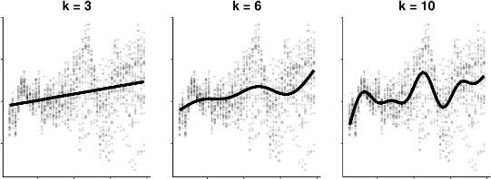

Let's load in our libraries for this tutorial. Notice that we are also using a function developed in an external script that we will load in using a function called `source`.

#Load libraries
```{r}
#General
library(here)
library(ggplot2)

#GLMM
library(lme4)
library(bbmle)
library(DescTools)
library(remotes)
library(gridExtra)
library(lattice)

#GAM & GAMM
library(mgcv)
library(itsadug)

source(here("data/glmm_funs.R"))
```

#GLMM

Let's load in our data on genetic variation in responses to fertilization and simulated herbivory in Arabidopsis plants. We are interested in the effect of nutrient availability and herbivory (fixed effects) on the fruit production (response variable) of Arabidopsis thaliana was evaluated by measuring 625 plants across 9 different populations, each comprised of 2 to 3 different genotypes (random effects)

In this dataset, the column headers are defined as:
*reg: region (e.g. NL for Netherlands)
*popu: factor with a level for each population 
*gen: factor with a level for each genotype
*rack: a nuisance factor with 2 levels, one for each of two greenhouse racks 
*nutrient: factor with levels for low (value = 1) or high (value = 8)
*amd: factor with levels for no damage or simulated herbivory
*total.fruits: integer indicating the number of fruits per plantf
##Load data
```{r}
#Load in data
dat.tf <- read.csv(here("data/arabidopsis.csv"))
```

Before we go any further, we need to select an error distribution. This choice will be informed by the structure of our data. Our response variable is count data which suggests we need a Poisson distribution (i.e. the variance is equal to the mean), but let's check several options.
##Explore data
```{r}
hist(dat.tf$total.fruits, breaks = 50, col = 'blue', main = '',
     xlab = 'Total fruits', ylab = 'Count')

# Let's explore the variance within our data
# Create new variables that represent every combination of variables
dat.tf <- within(dat.tf,
{
  # genotype x nutrient x clipping
  gna <- interaction(gen,nutrient,amd)
  gna <- reorder(gna, total.fruits, mean)
  # population x nutrient x clipping
  pna <- interaction(popu,nutrient,amd)
  pna <- reorder(pna, total.fruits, mean)
})

# Boxplot of total fruits vs genotype x nutrient x clipping interaction
ggplot(data = dat.tf, aes(factor(x = gna), y = log(total.fruits + 1))) +
  geom_boxplot(colour = "skyblue2", outlier.shape = 21,
  outlier.colour = "skyblue2") +
  ylab("log (Total fruits)\n") + # \n creates a space after the title
  xlab("\nGenotype x nutrient x clipping") + # space before the title
  theme_bw() + theme(axis.text.x = element_blank()) +
  stat_summary(fun = mean, geom = "point", colour = "red")

# Run a diagnostic plot of the group variances vs group means (genotype x nutrient x clipping grouping). 
# For example, among genotypes:
grpVars <- tapply(dat.tf$total.fruits, dat.tf$gna, var)

grpMeans <- tapply(dat.tf$total.fruits,dat.tf$gna, mean)

# Quasi-Poisson
lm1 <- lm(grpVars~grpMeans-1) 
phi.fit <- coef(lm1)
# The -1 specifies a model with the intercept set to zero

# Negative binomial
lm2 <- lm(grpVars ~ I(grpMeans^2) + offset(grpMeans)-1)
k.fit <- 1/coef(lm2)
# The offset() is used to specify that we want the group means added as a term with its coefficient fixed to 1

# Non-parametric loess fit
Lfit <- loess(grpVars~grpMeans)

# The plot
plot(grpVars ~ grpMeans, xlab = "Group means", ylab = "Group variances" )
abline(a = 0, b = 1, lty = 2)
text(105,500, "Poisson")
curve(phi.fit*x, col = 2, add = TRUE)
# bquote() is used to substitute numeric values in equations with symbols
text(110,3900,
     bquote(paste("QP: ", sigma^2==.(round(phi.fit,1))*mu)), col = 2)
curve(x*(1+x/k.fit), col = 4, add = TRUE)
text(104,7200, paste("NB: k = ", round(k.fit, 1), sep = ""), col = 4)
mvec <- 0:120
lines(mvec, predict(Lfit, mvec), col = 5)
text(118, 2000, "loess", col = 5)
```
Let's now check for and address overdispersion.

##Overdispersion
```{r}
# Poisson GLMM
# Given the mean-variance relationship, we will most likely need a model with over-dispersion.
# To understand why, let's start with a Poisson model.
mp1 <- glmer(total.fruits ~ nutrient*amd + rack + status +
             (1|popu)+
             (1|gen),
             data = dat.tf, family = "poisson")

# Over-dispersion check
overdisp_fun(mp1)
# Ratio is significantly > 1

# Negative binomial GLMM using the function glmer.nb()
mnb1 <- glmer.nb(total.fruits ~ nutrient*amd + rack + status +
                 (1|popu)+
                 (1|gen),
                 data = dat.tf,
                 control = glmerControl(optimizer = "bobyqa"))
# Control argument specifies the way we optimize the parameter values

# Over-dispersion check
overdisp_fun(mnb1)
# Ratio is now much closer to 1 although p < 0.05

# Poisson-lognormal GLMM

# This variable is already in your data "dat.tf", but here is how we create it:
dat.tf$X <- 1:nrow(dat.tf)

# Account for over-dispersion
mpl1 <- glmer(total.fruits ~ nutrient*amd + rack + status +
              (1|X) +
              (1|popu)+
              (1|gen),
data = dat.tf, family = "poisson",
control = glmerControl(optimizer = "bobyqa"))

# Over-dispersion check
overdisp_fun(mpl1)
# Ratio now meets our criterion, thus, < 1
```

Now let's fit and compare two other model structures.
##Compare models
```{r}
# popu only
mpl1.popu <- glmer(total.fruits ~ nutrient*amd + rack + status + 
                     (1|X) +
                     (1|popu), 
                     data=dat.tf, family="poisson", control=glmerControl(optimizer="bobyqa"))
 
# gen only
mpl1.gen <-glmer(total.fruits ~ nutrient*amd + rack + status + 
                   (1|X) +
                   (1|gen), 
                   data=dat.tf, family="poisson", control=glmerControl(optimizer="bobyqa"))
 
# IC approach using AICc
ICtab(mpl1, mpl1.popu, mpl1.gen, type = c("AICc"))

# Frequentist approach using LRT
anova(mpl1,mpl1.popu)

anova(mpl1,mpl1.gen)
```

#Question 1
Which is the best model out of the three tested?

Let's visualize the model parameters using the `coefplot2()` function from the	package `coefplot2`. Occasionally you will want to use a package that is either too new or homemade for CRAN. This is one such package. We can install it from GitHub using the remotes package by running the code below.

##Load external package
```{r}
if (!require("coefplot2"))
  remotes::install_github("palday/coefplot2", subdir = "pkg")
library(coefplot2)
```

##Visualize parameters
```{r}
# Variance terms
coefplot2(mpl1, ptype = "vcov", intercept = TRUE, main = "Random effect variance")

# Fixed effects
coefplot2(mpl1, intercept = TRUE, main = "Fixed effect coefficient")
```

Now let's visualize the random effects. You can extract the random effect predictions using ranef() and plot them using a dotplot() from the lattice package.

We observe differences among population :
Spanish populations (SP) have larger values than Swedish (SW) or Dutch (NL) populations
We observe mild differences among genotypes :
Difference among genotypes are largely driven by genotype 34

##Visualize random effects
```{r}
# dotplot code
pp <- list(layout.widths = list(left.padding = 0, right.padding = 0),
           layout.heights = list(top.padding = 0, bottom.padding = 0))
r2 <- ranef(mpl1, condVar = TRUE)
d2 <- dotplot(r2, par.settings = pp)

grid.arrange(d2$gen, d2$popu, nrow = 1)
```

##Model Selection
The same methods can be used with a GLMM or LMM to choose between models with various random intercepts and/or random slopes and to choose fixed effects to keep in final model.

Here are two approaches :
*an information theoretic approach (e.g., AICc - similar to Tutorial 03)
*a frequentist approach (where the significance of each term is evaluated using a likelihood ratio test; LRT, with the anova() function)

Let's fit some model options. We will not test all possible models. Keep in mind that the interaction amd:nutrient can only be evaluated if both amd and nutrient (i.e., the main effects) are included in the model.
###Define model options
```{r}
# Fit a generalized linear mixed-effects model (GLMM)
# Response variable: total.fruits (count data)
# Fixed effects: nutrient, amd, their interaction, rack, and status
# Random effects: X, popu, and gen
# Poisson error distribution with log link
# Optimizer set to "bobyqa" to improve convergence
mpl1 <- glmer(total.fruits ~ nutrient*amd + rack + status +
              (1|X) +
              (1|popu)+
              (1|gen),
data = dat.tf, family = "poisson",
control = glmerControl(optimizer = "bobyqa"))

# Create reduced models by removing one fixed effect at a time
# These models are used for model comparison and selection
mpl2 <- update(mpl1, . ~ . - rack) # model without rack
mpl3 <- update(mpl1, . ~ . - status) # model without status
mpl4 <- update(mpl1, . ~ . - amd:nutrient) # without amd:nutrient interaction

# Compare candidate models using AICc (corrected Akaike Information Criterion)
# Lower AICc values indicate better model support
aic_tab  <- MuMIn::model.sel(mpl1, mpl2, mpl3, mpl4)
# Extract and round key model selection statistics
# AICc: model fit
# delta: difference from the best model
# df: number of parameters
(round(aic_table <- aic_tab[ , c("AICc", "delta", "df")], digits = 2))

# Likelihood Ratio Tests (LRT) for each term in the full model
# Tests whether removing each term significantly reduces model fit
dd_LRT <- drop1(mpl1, test = "Chisq")
dd_LRT
```

#Question 2
Which is the best model? Do the AICc table and Liklihood ratio test agree?
What fixed effect seems the strongest based on the model selection tests you just did? Why do you think that?

Alternatively, we can use drop1() and dfun() functions to evaluate our fixed effects ( dfun() converts the AIC values returned by the drop1() into ΔAIC values)

###Alternative model selection
```{r}
# Alternative model comparison using AIC-based metrics from drop1()
(dd_AIC <- dfun(drop1(mpl1)))

# Start a new model set without the nutrient × amd interaction
mpl2 <- update(mpl1, . ~ . - amd:nutrient)

# Further reduced models removing additional main effects
mpl3 <- update(mpl2, . ~ . - rack)     # Model without rack or interaction
mpl4 <- update(mpl2, . ~ . - status)   # Model without status or interaction
mpl5 <- update(mpl2, . ~ . - nutrient) # Model without nutrient or interaction
mpl6 <- update(mpl2, . ~ . - amd)      # Model without amd (herbivory) or interaction

# Compare this second set of candidate models using AICc
aic_tab2  <- MuMIn::model.sel(mpl2, mpl3, mpl4, mpl5, mpl6)
# Extract and round model comparison statistics
(round(aic_table2 <- aic_tab2[ , c("AICc", "delta", "df")], digits = 2))

# Likelihood Ratio Tests for terms in the reduced (no-interaction) model
dd_LRT2 <- drop1(mpl2, test = "Chisq")
# AIC-based comparison for the reduced model
dd_AIC2 <- dfun(drop1(mpl2))
```

#Question 3
Is there a significant nutrient effect? What about of herbivory? If we were to construct a final model using this test, what would be the fixed effects and what would be the random effects included?

#GAM

We are going to review generalized additive models before we level up to generalized additive mixedm models.
For this part of the tutorial, we will use the ISIT dataset, containing measurements of deep-sea pelagic bioluminescence, recording how light emission levels (Sources) vary by SampleDepth (measured in meters) and Season (usually defined as Spring/Autumn or 1 and 2).
The data were collected in the NE Atlantic Ocean (west of Ireland/Porcupine Seabight) during 2001 and 2002 using a free-falling instrumented lander (ISIT - Intensified Silicon Intensifier Target video camera) measured bioluminescence stimulated by the device moving through the water.
For now, we will be focusing on Season 2 (Autumn). You will see that many variables were recorded in this dataset but the main variables that we will focus on are:
*SampleDepth - depth in meters
*Sources - bioluminescence
*Latitude - degrees latitude
*Season - 1 = spring and 2 = autumn
*RelativeDepth - depth in meters
##Load data
```{r}
isit <- read.csv(here("data/ISIT.csv"))
head(isit)

isit2 <- subset(isit, Season == 2)
```
Let's begin by trying to fit a linear regression model to the relationship between
`Sources` and `SampleDepth`.

##Linear model
```{r}
linear_model <- gam(Sources ~ SampleDepth, data = isit2)
summary(linear_model)
```

The linear model is explaining quite a bit of variance in our dataset (Radj = 0.588), which means it's a pretty good model, right?

Well, let's take a look at how our model fits the data:
##Plot LM
```{r}
data_plot <- ggplot(data = isit2, aes(y = Sources, x = SampleDepth)) +
  geom_point() +
  geom_line(aes(y = fitted(linear_model)),
            colour = "red", size = 1.2) +
  theme_bw()
data_plot
```

Yikes. Clearly the relationship is non-linear, and it also looks non-monotonic. Standard linear and even non-linear methods would not work well here. Let's try to fit a model to the data using a smooth function s() with mgcv::gam().

##Fit a GAM
```{r}
gam_model <- gam(Sources ~ s(SampleDepth), data = isit2)
summary(gam_model)
```

Now let's plot this and compare the GAMM to the linear model.

##Plot models
```{r}
data_plot <- data_plot +
     geom_line(aes(y = fitted(gam_model)),
               colour = "blue", size = 1.2)
data_plot

#The mgcv package also includes a default plot() function to look at the smooths.
plot(gam_model)
```

Note: as opposed to one fixed coefficient, β in linear regression, the smooth function can continually change over the range of the predictor x.

##Compare models
How do we test whether the non-linear model offers a significant improvement over the linear model?
We can use gam() and AIC() to compare the performance of a linear model containing x as a linear predictor to the performance of a non-linear model containing s(x) as a smooth predictor.
```{r}
linear_model <- gam(Sources ~ SampleDepth, data = isit2)
smooth_model <- gam(Sources ~ s(SampleDepth), data = isit2)
AIC(linear_model, smooth_model)
```

Here, the AIC of the smooth GAM is lower, which indicates that adding a smoothing function improves model performance. Linearity is therefore not supported by our data.

We will now try to determine whether this the data recorded in the first season should be modelled with a linear regression, or with an additive model.
Let's repeat the comparison test with gam() and AIC() using the data recorded in the first season (Spring) only:

##Subset Season 1
```{r}
isit1 <- subset(isit, Season == 1)
```

#Question 4
1. Fit a linear and smoothed GAM model to the relation between `SampleDepth` and `Sources`.
2. Determine if linearity is justified for this data.
    *As before, visualizing the model fit on our dataset is an excellent first step to determine whether our model is performing well.
    *We can supplement this with a quantitative comparison of model performance using AIC() .
3. How many effective degrees of freedom does the smoothed term have?
    *Hint: Print the model object.

##Multiple smooth terms
GAMs make it easy to include both smooth and linear terms, multiple smoothed terms, and smoothed interactions. For this section, we will use the ISIT data again. We will try to model the response Sources using the predictors Season and SampleDepth simultaneously.
First, we need to convert our categorical predictor ( Season ) into a factor variable.
```{r}
head(isit)
isit$Season <- as.factor(isit$Season)
```

Let us start with a basic model, with one smoothed term ( SampleDepth ) and one categorical predictor ( Season , which has 2 levels).
```{r}
basic_model <- gam(Sources ~ Season + s(SampleDepth), data = isit, method = "REML")
basic_summary <- summary(basic_model)

#The p.table provides information on the linear terms:
basic_summary$p.table

#The s.table provides information on the smooth term:
basic_summary$s.table

#Let's plot this model
par(mfrow=c(1,2))
plot(basic_model, all.terms = TRUE)
```

#Question 5
What do these plots tell us about the relationship between bioluminescence, sample depth, and seasons?

##Degrees of Freedom
Let's look at the `s.table` produced in the previous chunk. 
The `edf` shown in the	are the effective degrees of freedom (EDF) of the the smooth term	`s(SampleDepth)`. Essentially, more EDF imply more complex, wiggly splines:
*A value close to 1 tends to be close to a linear term.
*A higher value means that the spline is more wiggly (non-linear).
In our basic model the EDF of the smooth function s(SampleDepth) are ~9, which suggests a highly non-linear curve.

Let us come back to the concept of effective degrees of freedom (EDF).
Effective degrees of freedom give us a lot of information about the relationship between model predictors and response variables.

You might recognize the term "degrees of freedom" from previous stats classes about linear models, but be careful! The effective degrees of freedom of a GAM are estimated differently from the degrees of freedom in a linear regression, and are interpreted differently. 

In linear regression, the model degrees of freedom are equivalent to the number of non-redundant free parameters p in the model, and the residual degrees of freedom are given by n − p. Because the number of free parameters in GAMs is difficult to define, the EDF are instead related to the smoothing parameter λ, such that the greater the penalty, the smaller the EDF.

An upper bound on the EDF is determined by the basis dimension k for each smooth function (the EDF cannot exceed k − 1). In practice, the exact choice of k is arbitrary, but it should be large enough to accommodate a sufficiently complex smooth function.
We will talk about choosing k in upcoming sections.

##Add 2nd term
We can add a second term, RelativeDepth , but specify a linear relationship with Sources.
```{r}
two_term_model <- gam(Sources ~ Season + s(SampleDepth) + RelativeDepth,
                      data = isit, method = "REML")
two_term_summary <- summary(two_term_model)

#Information on parametric effects (linear terms):
two_term_summary$p.table

#Information on additive effects (non-linear terms):
two_term_summary$s.table

par(mfrow=c(2,2))
plot(two_term_model, all.terms = TRUE)
```

##Add 2nd smooth term
If we want to know whether the relationship between Sources and RelativeDepth is non-linear, we can model RelativeDepth as a smooth term instead. 
```{r}
two_smooth_model <- gam(Sources ~ Season + s(SampleDepth) + s(RelativeDepth),
                        data = isit, method = "REML")
two_smooth_summary <- summary(two_smooth_model)

#Information on parametric effects (linear terms):
two_smooth_summary$p.table

#Information on additive effects (non-linear terms):
two_smooth_summary$s.table

par(mfrow=c(2,2))
plot(two_smooth_model, page = 1, all.terms = TRUE)

AIC(basic_model, two_term_model, two_smooth_model)
```

As before, we can compare our models with AIC to test whether the smoothed term improves our model's performance. We can see that two_smooth_model has the lowest AIC value. The best fit model includes both smooth terms for SampleDepth and RelativeDepth, and a linear term for Season.

#Question 6
For our next question, we will be building onto our model by adding variables which we think might be ecologically significant predictors to explain bioluminescence.
1. Create two new models: Add `Latitude` to `two_smooth_model`, first as a linear term, then as a smoothed term.
2. Is `Latitude` an important term to include? Does `Latitude` have a linear or additive effect? Use plots, coefficient tables, and the `AIC()` function to help you answer this question.

##Interactions
There are two ways to include interactions between variables:
*for two smoothed variables : s(x1, x2)
*for one smoothed variable and one linear variable (either factor or continuous): use the by argument s(x1, by = x2)
When x2 is a factor, you have a smooth term that vary between different levels of x2
When x2 is continuous, the linear effect of x2 varies smoothly with x1
When x2 is a factor, the factor needs to be added as a main effect in the model

Let's examine interaction effects to determine whether the non-linear smoother s(SampleDepth) varies across different levels of Season .
```{r}
factor_interact <- gam(Sources ~ Season +
                         s(SampleDepth, by=Season) +
                         s(RelativeDepth),
                       data = isit, method = "REML")

summary(factor_interact)$s.table

par(mfrow = c(2,2))
plot(factor_interact)

#We can also visualise our model in 3D using vis.gam()
vis.gam(factor_interact, theta = 120, n.grid = 50, lwd = .4)
```

These plots hint that the interaction effect could be important to include in our model.
We will perform a model comparison using AIC to determine whether the interaction term improves our model's performance.

##Compare models
```{r}
AIC(two_smooth_model, factor_interact)
```

The AIC of our model with a factor interaction between the SampleDepth smooth and Season has a lower AIC score.
Together, the AIC and the plots confirm that including this interaction improves our model's performance.

Next, we'll look at the interactions between two smoothed terms, SampleDepth
and RelativeDepth .

##Two smoothed
```{r}
smooth_interact <- gam(Sources ~ Season + s(SampleDepth, RelativeDepth),
                       data = isit, method = "REML")
summary(smooth_interact)$s.table

plot(smooth_interact, page = 1, scheme = 2)

vis.gam(smooth_interact,
        view = c("SampleDepth", "RelativeDepth"),
        theta = 50, n.grid = 50, lwd = .4)

AIC(two_smooth_model, smooth_interact)
```

So, we can see an interaction effect between these smooth terms in these plots. The model with the interaction between s(SampleDepth) and s(RelativeDepth) has a lower AIC.
This means that the non-linear interaction improves our model's performance, and our ability to understand the drivers of bioluminescence.

##Generalization
The basic additive model can be extended in the following ways:
*Using other distributions for the response variable with the family argument (just as in a GLM),
*Using different kinds of basis functions,
*Using different kinds of random effects to fit mixed effect models.
We will now go over these aspects.

We have so far worked with simple (Gaussian) additive models, the non-linear equivalent to a linear model.
But, what can we do if:
*the observations of the response variable do not follow a normal distribution?
*the variance is not constant? (heteroscedasticity)
Just like generalized linear models (GLM), we can formulate generalized additive models to deal with these issues.

Let us return to our smooth interaction model for the bioluminescence data:
```{r}
smooth_interact <- gam(Sources ~ Season + s(SampleDepth, RelativeDepth),
                       data = isit, method = "REML")

summary(smooth_interact)$p.table

summary(smooth_interact)$s.table
```

As with a GLM, it is essential to check whether the model is correctly specified, especially in regards to the distribution of the response variable.
We need to verify:
*The choice of basis dimension k .
*The residuals plots (just as for a GLM).

Useful functions included in mgcv :
*k.check() performs a basis dimension check.
*gam.check() produces residual plots (and also calls k.check() ).

Remember the smoothing parameter λ, which constrains the wiggliness of our smoothing functions?
This wiggliness is further controlled by the basis dimension k, which sets the number of basis functions used to create a smooth function.
The more basis functions used to build a smooth function, the more wiggly the smooth:
{width=1000px}

The key to getting a good model fit is therefore to balance the trade-off between two things:
*The smoothing parameter λ, which penalizes wiggliness;
*The basis dimension k, which allows the model to wiggle according to our data.
Have we optimized the tradeoff between smoothness ( λ ) and wiggliness ( k ) in our model?
In other words, have we chosen a k that is large enough?

```{r}
k.check(smooth_interact)
```

The EDF are very close to k , which means the wiggliness of the model is being overly constrained. The tradeoff between smoothness and wiggliness is not balanced.

We can refit the model with a larger k :
```{r}
smooth_interact_k60 <- gam(Sources ~ Season + s(SampleDepth, RelativeDepth, k = 60),
                           data = isit, method = "REML")

#Is k large enough this time?
k.check(smooth_interact_k60)

#The EDF are much smaller than k . We can replace our previous model with this wigglier version:
smooth_interact <- smooth_interact_k60

#As with any Normal model, we must check some model assumptions before continuing.
#We can look at the residual plots with gam.check() :
par(mfrow = c(2,2))
gam.check(smooth_interact)
#Note that in addition to the plots, gam.check() also provides the output of k.check()
```

Notice that there is pronounced heteroscedasticity and some strong outliers in the residuals.

For our interaction model, we need a probability distribution that allows the variance to increase with the mean. One family of distributions that has this property and that works well in a GAM is the Tweedie family. A common link function for Tweedie distributions is the log.

As in a GLM, we can use the `family = argument` in `gam()` to fit models with other distributions (including distributions such as binomial, poisson, gamma, etc).

To get an overview of families available in mgcv :
```
?family.mgcv
```

#Question 7
1. Fit a new model `smooth_interact_tw` with the same formula as the `smooth_interact` model, but with a distribution from the *Tweedie* family (instead of the Normal distribution) and `log` link function. You can do so by using `family = tw(link = "log")` inside `gam()`.
2. Check the choice of `k` and the residual plots for the new model.
3. Compare `smooth_interact_tw` with `smooth_interact`. Which one would you choose?

Hint!
Because the Normal distribution is the default setting, we have not specified the distribution explicitly yet.

Here is how we would write the model to specify the Normal distribution:
```{r}
smooth_interact <- gam(Sources ~ Season + s(SampleDepth, RelativeDepth, k = 60),
                       family = gaussian(link = "identity"),
                       data = isit, method = "REML")
```

##Changing the basis

To model a non-linear smooth variable or surface, smooth functions can be built in different ways:
*s() for modelling a 1-dimensional smooth or for modeling interactions among variables measured using the same unit and the same scale
te() for modelling 2- or n-dimensional interaction surfaces of variables that are not on the same scale. Includes main effects.
ti() for modelling 2- or n-dimensional interaction surfaces that do not include the main effects.

The smooth functions have several parameters that can be set to change their behaviour. The most common parameters are :
k = basis dimension
*determines the upper bound of the number of base functions used to build the curve.
*constrains the wigglyness of a smooth.
*k should be < the number of unique data points.
*the complexity (i.e. non-linearity) of a smooth function in a fitted model is reflected by its effective degrees of freedom (EDF).

The smooth functions have several parameters that can be set to change their behaviour. The most often-used parameters are:
*d = specifies that predictors in the interaction are on the same scale or dimension (only used in te() and ti() ).
For example, in te(Time, width, height, d=c(1,2)) , indicates that width and height are one the same scale, but not Time .
*bs = specifies the type of basis functions.
the default for s() is tp (thin plate regression spline) and for te() and ti()
is cr (cubic regression spline).

Let's use a time series of climate data, with monthly measurements, to find a temporal trend in yearly temperature. We'll use the Nottingham temperature time series for this, which is included in R. Let's load the data and then plot the monthly temperature fluctuations for every year in the nottem dataset.
```{r}
# Nottingham temperature time series
data(nottem)

# the number of years of data (20 years)
n_years <- length(nottem)/12

# categorical variable coding for the 12 months of the year, for every
# year sampled (so, a sequence 1 to 12 repeated for 20 years).
nottem_month <- rep(1:12, times = n_years)

# the year corresponding to each month in nottem_month
nottem_year <- rep(1920:(1920 + n_years - 1), each = 12)

# Plot the time series
qplot(x = nottem_month, y = nottem,
      colour = factor(nottem_year),
      geom = "line") +
  theme_bw()
```

We can model both the cyclic change of temperature across months and the
non-linear trend through years, using a cyclical cubic spline, or cc , for the month variable and a regular smooth for the year variable.
```{r}
year_gam <- gam(nottem ~ s(nottem_year) + s(nottem_month, bs = "cc"), method = "REML")
summary(year_gam)$s.table

plot(year_gam, page = 1, scale = 0)
```

There is about 1-1.5 degree rise in temperature over the period, but within a given year there is about 20 degrees variation in temperature, on average. The actual data vary around these values and that is the unexplained variance.

#GAMM
When observations are not independent, GAMs can be used to either incorporate: 
*a correlation structure to model autocorrelated residuals, such as:
**the autoregressive (AR) model
**the moving average model (MA); or,
**a combination of both models (ARMA).
*random effects that model independence between observations at the same site.- random effects that model independence among observations from the same site.

Autocorrelation of residuals refers to the degree of correlation between the residuals (the differences between actual and predicted values) in a time series model.
In other words, if there is autocorrelation of residuals in a time series model, it means that there is a pattern or relationship between the residuals at one time and the residuals at other times.

Autocorrelation of residuals is usually measured using the ACF (autocorrelation function) and pACF (partial autocorrelation function) graphs, which show the correlation between residuals at different lags.
If the ACF or pACF graphs show significant correlations at non-zero lags, there is evidence of autocorrelation in the residuals and the model may need to be modified or improved to better capture the underlying patterns in the data.

Let's see how this works with our year_gam model.

Let's first have a look at a model with temporal autocorrelation in the residuals. We will revisit the Nottingham temperature model and test for correlated errors using the (partial) autocorrelation function.
```{r}
par(mfrow = c(1,2))
acf(resid(year_gam), lag.max = 36, main = "ACF")
pacf(resid(year_gam), lag.max = 36, main = "pACF")
```

ACF evaluates the cross correlation and pACF the partial correlation of a time series with itself at different time lags (i.e. similarity between observations at increasingly large time lags).
The ACF and pACF plots are thus used to identify the time steps are needed before observations are no longer autocorrelated.
The ACF plot of our model residuals suggests a significant lag of 1, and perhaps a lag of 2. Therefore, a low-order AR model is likely needed.

We can add AR structures to the model:
AR(1): correlation at 1 time step, or
AR(2) correlation at 2 time steps.
```{r}
df <- data.frame(nottem, nottem_year, nottem_month)

year_gam <- gamm(nottem ~ s(nottem_year) + s(nottem_month, bs = "cc"), data = df)

year_gam_AR1 <- gamm(nottem ~ s(nottem_year) + s(nottem_month, bs = "cc"),
                     correlation = corARMA(form = ~ 1|nottem_year, p = 1),
                     data = df)

year_gam_AR2 <- gamm(nottem ~ s(nottem_year) + s(nottem_month, bs = "cc"),
                     correlation = corARMA(form = ~ 1|nottem_year, p = 2),
                     data = df)

AIC(year_gam$lme, year_gam_AR1$lme, year_gam_AR2$lme)
```

The AR(1) provides a significant increase in fit over the naive model ( year_gam ), but there is very little improvement in moving to the AR(2) .
So, it is best to include only the AR(1) structure in our model.

As we saw in the section about changing the basis, `bs` specifies the type of underlying base function. For random intercepts and linear random slopes we use `bs = "re"` , but for random smooths we use `bs = "fs"` .
3 different types of random effects in GAMMs ( fac = factor coding for the random effect; x0 = continuous fixed effect):
*random intercepts adjust the height of other model terms with a constant value: `s(fac, bs = "re")`
*random slopes adjust the slope of the trend of a numeric predictor: `s(fac, x0, bs = "re")` 
*random smooths adjust the trend of a numeric predictor in a nonlinear way: `s(x0, fac, bs = "fs", m = 1)`, where the argument m=1 sets a heavier penalty for the smooth moving away from 0, causing shrinkage to the mean.

We will use the gamSim() function to generate a dataset with a random effect, then run a model with a random intercept using `fac` as the random factor.
```{r}
# generate and view data
gam_data2 <- gamSim(eg = 6)
head(gam_data2)

# run random intercept model
gamm_intercept <- gam(y ~ s(x0) + s(fac, bs = "re"), data = gam_data2, method = "REML")

# examine model output
summary(gamm_intercept)$s.table

plot(gamm_intercept, select = 2)
# select = 2 because the random effect appears as the second entry in the summary table.
```

We can plot the summed effects for the x0 without random effects, and then plot the predictions of all 4 levels of the random fac effect:

```{r}
par(mfrow = c(1,2), cex = 1.1)

# Plot the summed effect of x0 (without random effects)
plot_smooth(gamm_intercept, view = "x0", rm.ranef = TRUE,
            main = "intercept + s(x1)")

# Plot each level of the random effect
plot_smooth(gamm_intercept, view = "x0", rm.ranef = FALSE,
            cond = list(fac="1"),
            main = "... + s(fac)", col = 'orange', ylim = c(0,25))
plot_smooth(gamm_intercept, view = "x0", rm.ranef = FALSE,
            cond = list(fac = "2"),
            add = TRUE, col = 'red')
plot_smooth(gamm_intercept, view="x0", rm.ranef = FALSE,
            cond = list(fac = "3"),
            add = TRUE, col = 'purple')
plot_smooth(gamm_intercept, view="x0", rm.ranef = FALSE,
            cond = list(fac = "4"),
            add = TRUE, col = 'turquoise')
```

Next, we will run and plot a model with a random slope:
```{r}
gamm_slope <- gam(y ~ s(x0) + s(x0, fac, bs = "re"), data = gam_data2, method = "REML")

summary(gamm_slope)$s.table

par(mfrow = c(1,2), cex = 1.1)

# Plot the summed effect of x0 (without random effects)
plot_smooth(gamm_slope, view = "x0", rm.ranef = TRUE,
            main = "intercept + s(x1)")

# Plot each level of the random effect
plot_smooth(gamm_slope, view = "x0", rm.ranef = FALSE,
            cond = list(fac="1"),
            main = "... + s(fac, x0)", col = 'orange', ylim = c(0,25))
plot_smooth(gamm_slope, view = "x0", rm.ranef = FALSE,
            cond = list(fac = "2"),
            add = TRUE, col = 'red')
plot_smooth(gamm_slope, view="x0", rm.ranef = FALSE,
            cond = list(fac = "3"),
            add = TRUE, col = 'purple')
plot_smooth(gamm_slope, view="x0", rm.ranef = FALSE,
            cond = list(fac = "4"),
            add = TRUE, col = 'turquoise')
```

Next, we will run and plot a model with a random intercept and slope:
```{r}
gamm_int_slope <- gam(y ~ s(x0) + s(fac, bs = "re") + s(fac, x0, bs = "re"),
                      data = gam_data2, method = "REML")

summary(gamm_int_slope)$s.table

par(mfrow = c(1,2), cex = 1.1)

# Plot the summed effect of x0 (without random effects)
plot_smooth(gamm_int_slope, view = "x0", rm.ranef = TRUE,
            main = "intercept + s(x1)")

# Plot each level of the random effect
plot_smooth(gamm_int_slope, view = "x0", rm.ranef = FALSE,
            cond = list(fac="1"),
            main = "... + s(fac) + s(fac, x0)", col = 'orange', ylim = c(0,25))
plot_smooth(gamm_int_slope, view = "x0", rm.ranef = FALSE,
            cond = list(fac = "2"),
            add = TRUE, col = 'red')
plot_smooth(gamm_int_slope, view="x0", rm.ranef = FALSE,
            cond = list(fac = "3"),
            add = TRUE, col = 'purple')
plot_smooth(gamm_int_slope, view="x0", rm.ranef = FALSE,
            cond = list(fac = "4"),
            add = TRUE, col = 'turquoise')

plot(gamm_int_slope, select=3)
# select = 3 because the random slope appears as the third entry in your summary table.
```
Note that the random slope is static in this case.

Lastly, we will examine a model with a random smooth.
```{r}
gamm_smooth <- gam(y ~ s(x0) + s(x0, fac, bs = "fs", m = 1),
                   data = gam_data2, method = "REML")

summary(gamm_smooth)$s.table

plot(gamm_smooth, select=1)
# select = 1 because the smooth slope appears as the first entry in your summary table.

par(mfrow = c(1,2), cex = 1.1)

# Plot the summed effect of x0 (without random effects)
plot_smooth(gamm_smooth, view = "x0", rm.ranef = TRUE,
            main = "intercept + s(x1)")

# Plot each level of the random effect
plot_smooth(gamm_smooth, view = "x0", rm.ranef = FALSE,
            cond = list(fac="1"),
            main = "... + s(fac) + s(fac, x0)", col = 'orange', ylim = c(0,25))
plot_smooth(gamm_smooth, view = "x0", rm.ranef = FALSE,
            cond = list(fac = "2"),
            add = TRUE, col = 'red')
plot_smooth(gamm_smooth, view="x0", rm.ranef = FALSE,
            cond = list(fac = "3"),
            add = TRUE, col = 'purple')
plot_smooth(gamm_smooth, view="x0", rm.ranef = FALSE,
            cond = list(fac = "4"),
            add = TRUE, col = 'turquoise')
```

All of the mixed models from this section can be compared using AIC() to determine the best fit model
```{r}
AIC(gamm_intercept, gamm_slope, gamm_int_slope, gamm_smooth)
```

#Question 8
Which is the best model? Explain your reasoning. Hint: AICs are similar so consider AIC but don't rely entirely on it.

#Acknowledgements and Copyright Information
```
Parts of this tutorial are adapted from a workshop originally developed by Cédric Frenette Dussault, Vincent Fugère, Thomas Lamy, Zofia Taranu.
https://r.qcbs.ca/workshops/r-workshop-08/ 
The workshop was modified for SFR 605 according to its license: CC BY-NC-SA 4.0
```
